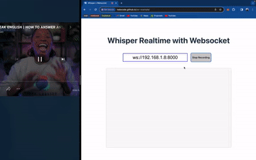
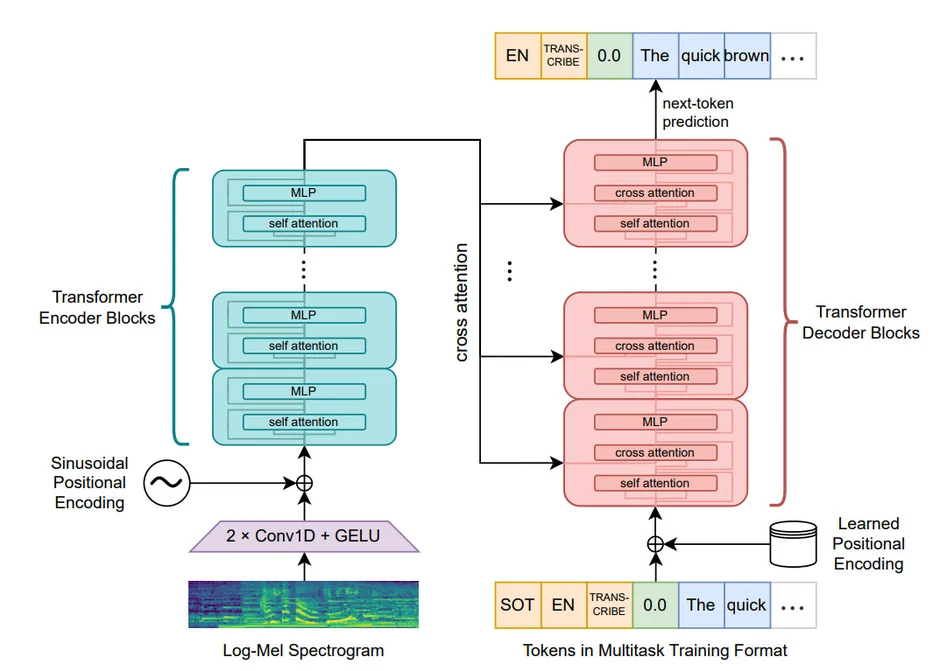
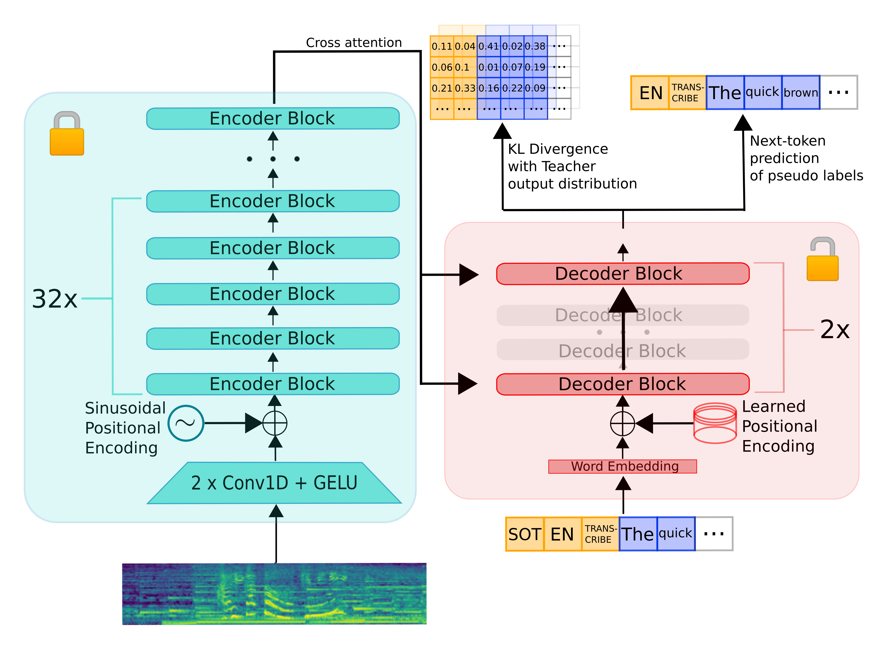
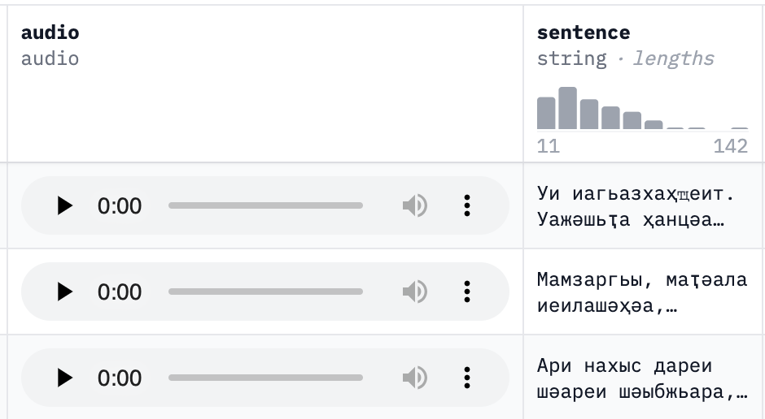
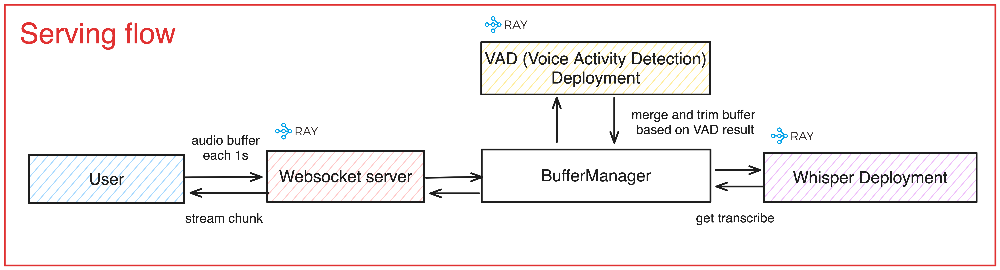

# Realtime ASR System Example

[](https://youtu.be/aTMmpaFe1h0)

> Serving on my GTX 1050ti Laptop, Click on gif watch youtube video

> [!IMPORTANT]
> Demo is online at https://tsdocode.github.io/whisper-ray-socket/


> [!IMPORTANT]
> This repository is my practice on training and serving a realtime Automatic Speech Recognition (ASR) System.


##### Table of Contents  
[1. Introduction](#1-introduction)  
[2. Training](#2-training)  
[3. Serving](#3-serving)  
[4. Improvement](#4-improvement)  
[5. References](#5-references)  

## 1. Introduction
In the digital era, Automatic Speech Recognition (ASR) systems have become ubiquitous, with well-known examples including Google's Text-to-Speech, IBM Watson, and Amazon Polly. However, this repository focuses on self-hosted models, specifically OpenAI's Whisper and its distilled version, Distil Whisper. These models offer a promising avenue for those looking to deploy powerful ASR systems within their own infrastructure.

This repo will cover the basics of the Whisper and Distil Whisper models, including how to fine-tune Distil Whisper using Accelerate and optimize its hyperparameters. We'll also explore how to convert the model to a faster version suitable for real-time applications and discuss the process of uploading the final model to Hugging Face for easy access and deployment.

## 2. Training

### 2.1 OpenAI Whisper Model


The Whisper model by OpenAI represents a significant advancement in ASR technology, designed to provide high accuracy across a wide range of languages and domains. This section will introduce the model's architecture, capabilities, and how it can be leveraged for custom ASR solutions.

Some key highlights:
- Train using large amount of audio data
- Support multilingual


### 2.2 Distil-Whisper

Distil Whisper is a more compact and efficient version of the Whisper model, retaining much of its parent model's accuracy while being more resource-friendly. This part will discuss the distillation process and the benefits of using Distil Whisper for real-time ASR applications.

> It is a distilled version of the Whisper model that is 6 times faster, 49% smaller, and performs within 1% WER on out-of-distribution evaluation sets. This is the repository for distil-large-v2, a distilled variant of Whisper large-v2.

### 2.3 Fine-tune Whisper
Fine-tuning the Whisper model allows for greater accuracy and customization to specific domains or accents. This subsection will guide through the steps needed to fine-tune the Whisper model effectively.

The training flow is accoring to official distil whisper guide:
https://github.com/huggingface/distil-whisper/tree/main/training

#### 2.3.1 Prepare Dataset
A high-quality dataset is crucial for successful model fine-tuning. This subsection will cover dataset preparation, including selection, cleaning, and formatting guidelines.

- Dataset will look like:



#### 2.3.2 Run Pseudo Labeling
Pseudo labeling is a technique to expand the training dataset using the model's own predictions. This part will explain how to implement pseudo labeling to enhance the fine-tuning process.

```sh
#!/usr/bin/env bash

accelerate launch run_pseudo_labelling.py \
  --model_name_or_path "openai/whisper-large-v2" \ 
  --dataset_name "mozilla-foundation/common_voice_13_0" \ 
  --dataset_config_name "hi" \
  --dataset_split_name "train+validation+test" \
  --text_column_name "sentence" \
  --id_column_name "path" \
  --output_dir "./common_voice_13_0_hi_pseudo_labelled" \
  --wandb_project "distil-whisper-labelling" \
  --per_device_eval_batch_size 64 \
  --dtype "bfloat16" \
  --dataloader_num_workers 16 \
  --preprocessing_num_workers 16 \
  --logging_steps 500 \
  --max_label_length 128 \
  --report_to "wandb" \
  --language "hi" \
  --task "transcribe" \
  --return_timestamps \
  --attn_type "flash_attn" \
  --streaming False \
  --generation_num_beams 1 \
  --decode_token_ids False \
  --push_to_hub
```

Some Important arguments:
- **--dataloader_num_workers:** number of worker use to preprocess dataset
- **--per_device_eval_batch_size**: inference batch size per devices, the larger the more vRAM need
- **--language**: main language of dataset


#### 2.3.3 Create Student Model
Creating a student model involves distilling knowledge from the larger Whisper model. This section will describe how to create and train a student model for improved efficiency.

```sh
#!/usr/bin/env bash
python create_student_model.py \
  --teacher_checkpoint "openai/whisper-large-v2" \
  --encoder_layers 32 \
  --decoder_layers 2 \
  --save_dir "./distil-large-v2-init"
```

Some Important arguments:
- **--encoder_layers:** number of trainable encoder
- **--decoder_layers**: number of trainable decoder


#### 2.3.4 Run Distillation
Distillation is the process of transferring knowledge from the Whisper model to the student model. This subsection will detail the distillation process and best practices.


```bash
#!/usr/bin/env bash

accelerate launch run_distillation.py \
  --model_name_or_path "./distil-large-v2-init" \
  --teacher_model_name_or_path "openai/whisper-large-v2" \
  --train_dataset_name "../common_voice_13_0_hi_pseudo_labelled+../common_voice_13_0_hi_pseudo_labelled" \
  --train_dataset_config_name "hi+hi" \
  --train_split_name "train+validation" \
  --text_column_name "sentence+sentence" \
  --train_dataset_samples "10+5" \
  --eval_dataset_name "../common_voice_13_0_hi_pseudo_labelled" \
  --eval_dataset_config_name "hi" \
  --eval_split_name "test" \
  --eval_text_column_name "sentence" \
  --eval_steps 1000 \
  --save_steps 1000 \
  --warmup_steps 50 \
  --learning_rate 0.0001 \
  --lr_scheduler_type "constant_with_warmup" \
  --logging_steps 25 \
  --save_total_limit 1 \
  --max_steps 5000 \
  --wer_threshold 10 \
  --per_device_train_batch_size 64 \
  --per_device_eval_batch_size 64 \
  --dataloader_num_workers 16 \
  --preprocessing_num_workers 16 \
  --ddp_timeout 7200 \
  --dtype "bfloat16" \
  --output_dir "./" \
  --do_train \
  --do_eval \
  --gradient_checkpointing \
  --overwrite_output_dir \
  --predict_with_generate \
  --freeze_encoder \
  --streaming False \
  --push_to_hub
```


Some Important arguments:
- **per_device_train_batch_size:** Training batch size
- **per_device_eval_batch_size**: Evaluation batch size
- **train_dataset_name**: dataset name (pseudo labeled), we can combine multiple dataset using + operator.


#### 2.3.5 Convert Model to c2translate Format
faster-whisper is a reimplementation of OpenAI's Whisper model using CTranslate2, which is a fast inference engine for Transformer models.

```bash
pip install transformers[torch]>=4.23
pip install faster-whisper

ct2-transformers-converter --model openai/whisper-large-v3 --output_dir whisper-large-v3-ct2
--copy_files tokenizer.json preprocessor_config.json --quantization float16
```

#### 2.3.6 Upload Model to Hugging Face
Follow: https://huggingface.co/docs/hub/en/models-uploading

## 3. Serving

Deploying an ASR system in a real-time environment requires careful consideration of latency, scalability, and reliability. This section will focus on using WebSockets for real-time audio processing and how to manage audio streams effectively.



Flow:
- User (client) send audio buffer (recorded from mic) via websocket in arrayBuffer format each 1s
- Websocket server receives buffer and starts async process
- Buffer manager merges with existed buffer of the client and runs VAD on merge buffer and trim buffer based on VAD result 
- Buffer manager returns buffer to asr (buffer which has voice activity)
- Do speech recognition with this buffer, then send the transcribed message back to the user

### 3.1 Buffer Management Method
Managing audio buffers efficiently is crucial for minimizing latency in real-time ASR systems. This subsection will discuss strategies for buffer management and how to ensure seamless audio processing.


### 3.2 Deployment
This part will cover the deployment process, including server setup, WebSocket configuration, and ensuring your ASR system is scalable and reliable.

The whole websocket system and deploy using Ray serve in a ray cluster

Step to run:
1. Start a Ray cluster (skip if you already have)
```
pip install -r requirements.txt
ray start --head
```

2. Serve all deployments

```
cd serve
serve deploy serve.yaml
```

Websocket will be locate at ws://0.0.0.0:8000

## 4. Improvement
- Merge result of chunks for better context
- whisper.cpp ?
- Continuous batching for better through put
- ...

## 5. References

1. [Whisper Live](https://github.com/collabora/WhisperLive)
2. [Streaming Whisper](https://github.com/ufal/whisper_streaming)

